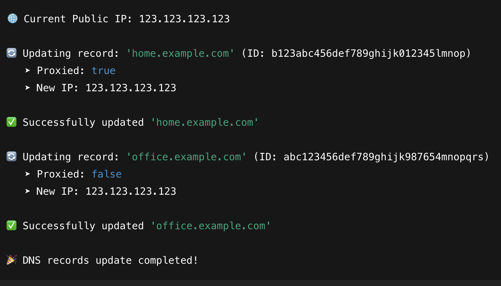

# duc


A simple and fast DUC service to update domain's records (including A, AAAA, CNAME, etc), written in Rust.
Provide suitable .env configuration to get started.
CloudFlare supported!
---

## ✨ Features

- Fast and minimal disk usage analyzer
- Recursively calculates total size of files and directories
- Human-readable output
- Easy to use via command line

---

## 🚀 Quick Installation

### Prerequisites
- [Rust & Cargo](https://www.rust-lang.org/tools/install) must be installed.

### Install with Cargo (Recommended)
1.  
```bash
cp .env.sample .env
```

2. Install
```bash
cargo install --git https://github.com/transybao1393/duc
```

### Screeshots

