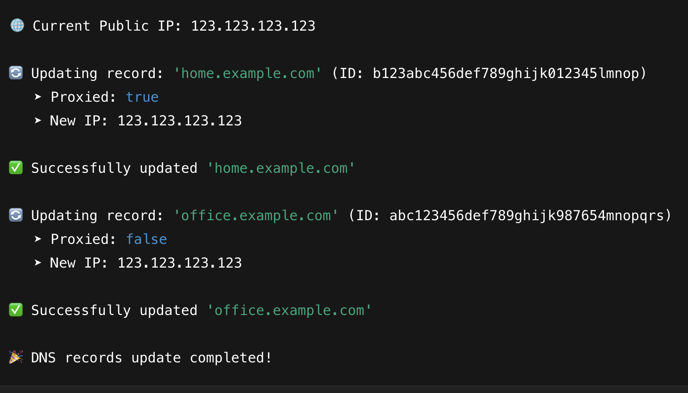
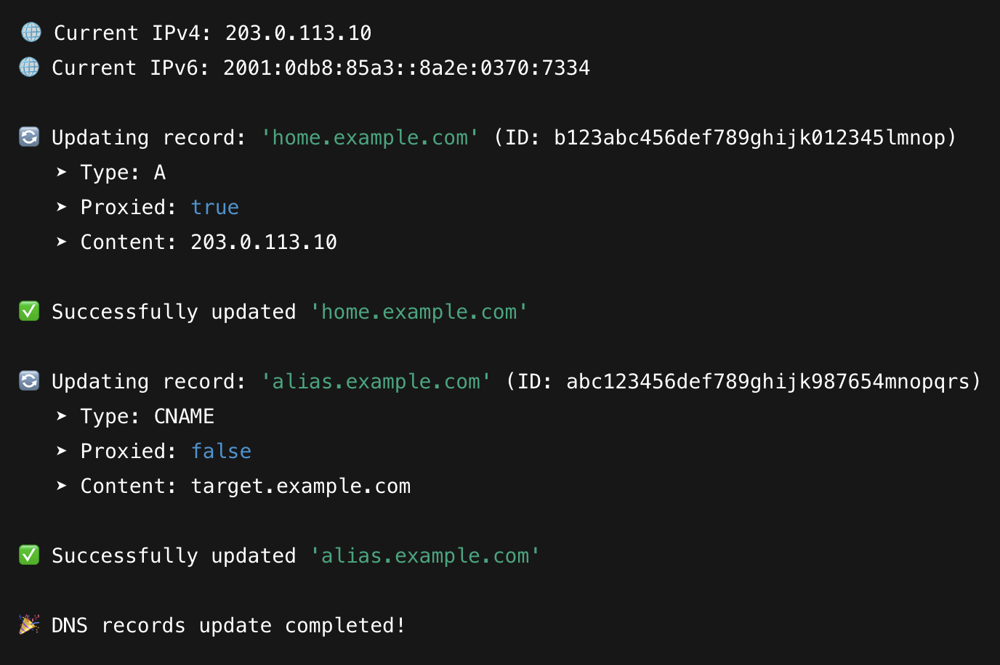

# duc


A simple and fast **Dynamic DNS (DUC)** service written in Rust.  
Easily update your public IP address to **Cloudflare DNS records** (supports **A, AAAA, CNAME, CAA, CERT**, and more).  
Just provide a `.env` configuration file and get started. **Cloudflare supported out of the box!**

---

## ✨ Features

- Automatically update public IP address to Cloudflare DNS records
- Supports multiple DNS record types: A, AAAA, CNAME, CAA, CERT, etc.
- Minimal, fast, and written in Rust
- Easy to set up via `.env` file
- Suitable for home servers, self-hosted services, and dynamic IP environments

---

## 🚀 Quick Installation

### Prerequisites
- [Rust & Cargo](https://www.rust-lang.org/tools/install) must be installed.
- A **Cloudflare account** with API token (for updating DNS records).

---

### ⚙️ Setup & Install

#### 1. Clone the repo (or download)

```bash
git clone https://github.com/transybao1393/duc.git
cd duc
cargo install --git https://github.com/transybao1393/duc
```


### Install with Cargo (Recommended)
1.  Create .env file from .env.sample
```bash
cp .env.sample .env
```

2. Install
```bash
cargo install --git https://github.com/transybao1393/duc
```

### Screeshots
A record update



A and CNAME records update


